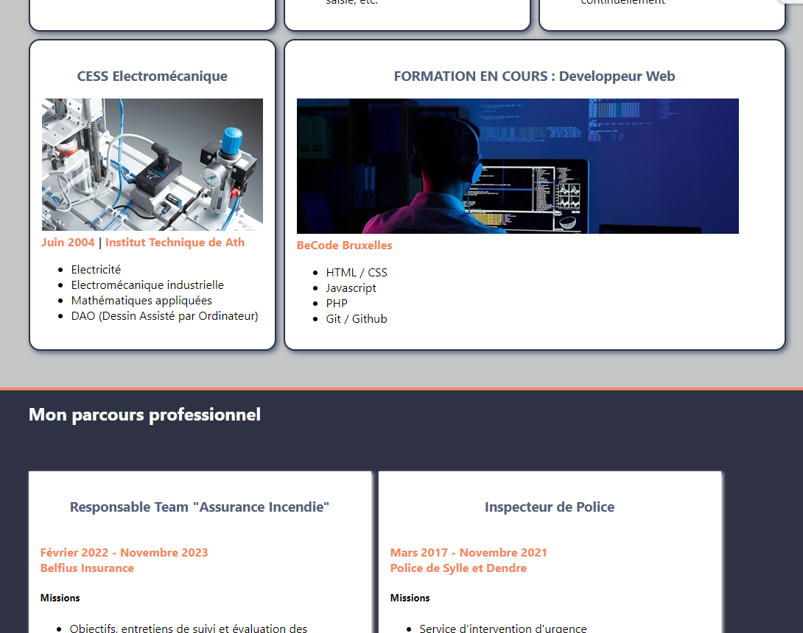
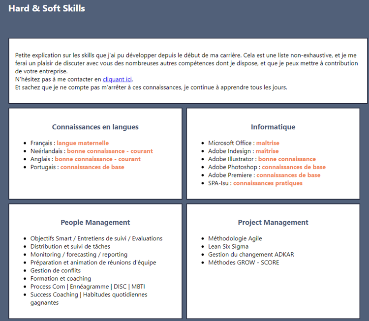
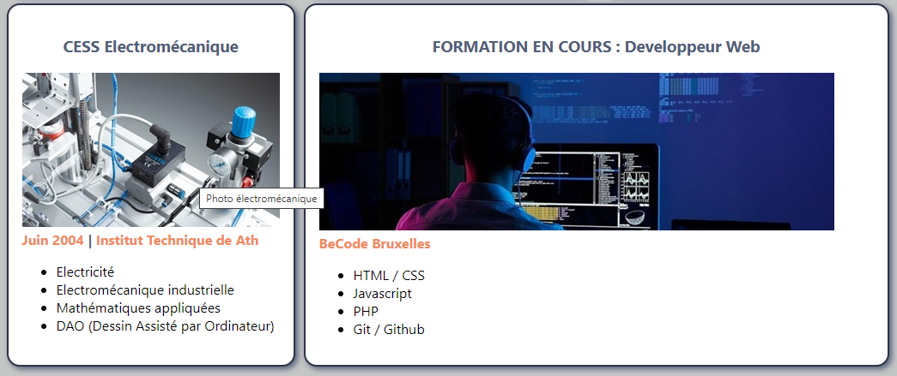

# Exercice 05 - Le Curriculum Vitae

## Objectif de l'exercice

L'objectif principal est de créer une page web qui constituera un cv en ligne, qui permettra d'expérimenter les propriétés de structuration de la page en utilisant les colonnes, ainsi que l'application de propriétés CSS.

## Statut de l'exercice
23/05/2024 - **DONE**  
==> En attente de la vérification et des remarques / avis

## Les étapes

1. Préparation
    - Création de pages html et css
    - Création d'un dossier "pictures"
2. Penser le projet
    - Réflexion sur la structure du site, et traduction en balises structurantes html5
    - Réflexion sur la charte graphique (couleurs, police d'écriture)
3. On passe à l'action
    - Compléter index.html
    - Mise en page CSS grâce aux grids
    - Mise en page CSS afin mettre en couleur les différents éléments

## Les difficultés recontrées et solutions

1. **RESOLUE** : Comment structurer à l'aide des colonnes (problèmes dans les 100%) ==> création d'une branche
2. **RESOLUE** : Comment faire disparaitre les bandes blanches au-dessus et en-dessous de nos div ==> connaissance des margins et paddings
3. **NON RESOLUE** : quels display choisir (inline, block, etc.)
4. **NON RESOLUE** : pourquoi y-a-t-il un débordement entre une section supérieure et une autre ? (voir photos 01 et 02)
5. **NON RESOLUE** : comment faire pour que les photos s'adaptent à la taille des "< article >" ? (voir photo 02)

## Annexes

### Photo 01

### Photo 02

### Photo 03
